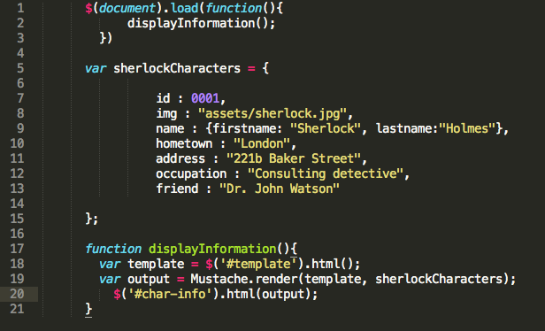

# Flexbox and Templating

**Templating with Mustache**
According to the article *"Javascript Templating Language and Engine—Mustache.js with Node and Express*, Javascript templating is a fast and efficient technique used to render client side tmplates with JS by using a JSON data source.

**Mustache**
One such template is called __Mustache__. It does not use logic syntax. It works by expanding tags in a template using values provided in a hash or object and is often reffered to as **"logic-less** because it doesn't have if statements, else clauses or for loops. Hwever, it is sometimes considered the base of JS templating. Here's a sample mustache syntax from the article:

Mustache.render(“Hello, {{name}}”, { name: “Sherlynn” });
// returns: Hello, Sherlynn

In the above example the two {{name}} around is a mustache syntax showing it is a placeholder. Mustache looks for the 'name' property in the object we pass and replaces {{name}} with the actual vales, in this case it is "Sherlynn".

Heres a sample of mustache code in a JS file from Google:

**A guide to Flexbox**

According to Mozilla Developers Network (MDN) the basic concept of flexbox it that it was designed as a one dimensional layout model and as a method that offers space distribution between items in an interface as well as alignment capabilities. 

Flexbox uses two axes:

1. **The main axis** - is defined by flex direction:
  -row
  -row-reverse
  if you use row or row-reverse axis your main axis will run along the row in an inline direction as seen here.

  

  -column
  -column-reverse
  if you use the column or column-reverse your main axis will run vertical on the page as seen here.

  

  2. **The Cross Axis** - Runs perpendicular to the main axis. If the flex direction (main axis) is set to row or row-reverse the cross axis will run down the column as seen here.
  

  if the the main axis is column or column-reverse then the cross axis runs along the rows as seen here.
  

**Flex-wrap** - By default, flex items will try to ll fit on one line. This can be fixed in css with the following code:

.container {
  flex-wrap: nowrap | wrap | wrap-reverse;
}

* __nowrap (default):__ all flex items will be on one line
* __wrap:__ flex items will wrap onto multiple lines, from top to bottom.
* __wrap-reverse:__ flex items will wrap onto multiple lines from bottom to top.

References:

1. https://medium.com/@1sherlynn/javascript-templating-language-and-engine-mustache-js-with-node-and-express-f4c2530e73b2
1. https://developer.mozilla.org/en-US/docs/Web/CSS/CSS_Flexible_Box_Layout/Basic_Concepts_of_Flexbox
1. https://css-tricks.com/snippets/css/a-guide-to-flexbox/
